# DPANG UPLOAD SERVER

## 🌐 프로젝트 개요

이 프로젝트는 파일 업로드 서비스를 지원하는 마이크로서비스로서, 사용자의 파일 업로드 기능을 제공합니다.

이를 통해 사용자의 파일 업로드 관련 작업을 효율적으로 관리하고, 사용자 경험을 향상시키는데 중점을 두고 있습니다.

## 🔀 프로젝트 아키텍처

아래의 시퀀스 다이어그램은 본 프로젝트의 핵심 컴포넌트인 Spring Cloud Gateway와 Upload 서비스 간의 상호 작용을 보여줍니다.

```mermaid
sequenceDiagram
    participant Client as Client
    participant Gateway as Spring Cloud Gateway
    participant UploadService as Upload Server
    participant MySQL as MySQL
    
    Client ->> Gateway: 요청 전송 (JWT 토큰 포함)
    Gateway ->> Gateway: 요청 인증 및 인가

    alt 인증 성공
        Gateway ->> UploadService: 요청 전달 <br> (X-DPANG-CLIENT-ID, X-DPANG-CLIENT-ROLE 헤더 추가)
        UploadService ->> UploadService: 해당 요청 권한 식별

        alt 요청이 역할에 적합
            UploadService ->> MySQL: 데이터 요청
            MySQL -->> UploadService: 데이터 응답
            UploadService ->> UploadService: 응답 처리
            UploadService -->> Gateway: 응답 전송
            Gateway -->> Client: 최종 응답 전달

        else 요청이 역할에 부적합
            UploadService -->> Gateway: 사용자 권한 없음 응답
            Gateway -->> Client: 사용자 권한 없음 응답
        end

    else 인증 실패
        Gateway -->> Client: 인증 실패 응답
    end

```



이 시퀀스 다이어그램을 통해 볼 수 있듯이, 모든 클라이언트 요청은 Spring Cloud Gateway를 통해 인증 단계를 거칩니다.
이 인증이 성공적으로 완료된 요청만이 서비스 요청을 계속 진행할 수 있습니다.

인증이 성공적으로 이루어지면, 'X-DPANG-CLIENT-ID'와 'X-DPANG-CLIENT-ROLE'이라는 사용자 정의 헤더에 각각 사용자의 ID와 Role 정보가 추가되어 Upload 서비스에 전달됩니다.
이 헤더 정보를 통해 Upload 서비스는 요청을 보낸 사용자를 정확히 인식하고, 요청을 적절하게 처리한 후 결과를 반환합니다.

## ✅ 프로젝트 실행

해당 프로젝트를 추가로 개발 혹은 실행시켜보고 싶으신 경우 아래의 절차에 따라 진행해주세요

#### 1. `secret.yml` 생성

```commandline
cd ./src/main/resources
touch secret.yml
```

#### 2. `secret.yml` 작성

```yaml
spring:
  application:
    name: image-upload-server

eureka:
  instance:
    prefer-ip-address: true

  client:
    register-with-eureka: true
    fetch-registry: true
    service-url:
      defaultZone: http://{YOUR_EUREKA_SERVER_IP}:{YOUR_EUREKA_SERVER_PORT}/eureka/

kakao-cloud:
  account: { YOUR_KAKAO_CLOUD_ACCOUNT }
  bucket: { YOUR_KAKAO_CLOUD_BUCKET }
  access-key-id: { YOUR_KAKAO_CLOUD_ACCESS_KEY_ID }
  access-secret-key: { YOUR_KAKAO_CLOUD_ACCESS_SECRET_KEY }
```

#### 3. 프로젝트 실행

```commandline
./gradlew bootrun
```

**참고) 프로젝트가 실행 중인 환경에서 아래 URL을 통해 API 명세서를 확인할 수 있습니다**

```commandline
http://localhost:8080/swagger-ui/index.html
```